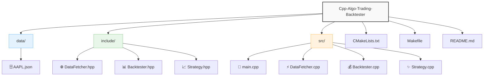

# Cpp-Algo-Trading-Backtester
# 📊 C++ AlgoTrading Backtester

Профессиональный бэктестер для алгоритмической торговли на C++ с подключением к реальным рыночным данным через API Alpha Vantage.

## 🚀 Возможности

- 📡 Загрузка исторических данных через **Alpha Vantage API**
- 📈 Реализация стратегии **SMA Crossover** (скользящие средние)
- 💻 Оптимизированный код на **C++17**
- 📊 Визуализация результатов через Python (опционально)
- 📦 Простая сборка через CMake/Make

## ⚙️ Установка

### Требования
- Компилятор C++17 (GCC 9+, Clang 10+, MSVC 2019+)
- Библиотеки: `libcurl`, `nlohmann-json`
- Python 3.8+ (для визуализации)

# 🛠 Сборка и запуск

bash

Клонировать репозиторий
git clone https://github.com/yourname/Cpp-Algo-Trading-Backtester.git
cd Cpp-Algo-Trading-Backtester

# Сборка через Make

make && ./backtester

# Или через CMake

mkdir build && cd build
cmake .. && make
./backtester

# 🔑 Настройка API

Получите бесплатный API-ключ на Alpha Vantage

Вставьте ключ в src/main.cpp:

cpp
const std::string api_key = "YOUR_API_KEY";

# 📜 Лицензия

MIT License. Подробнее в файле LICENSE.

# 📂 Структура проекта

